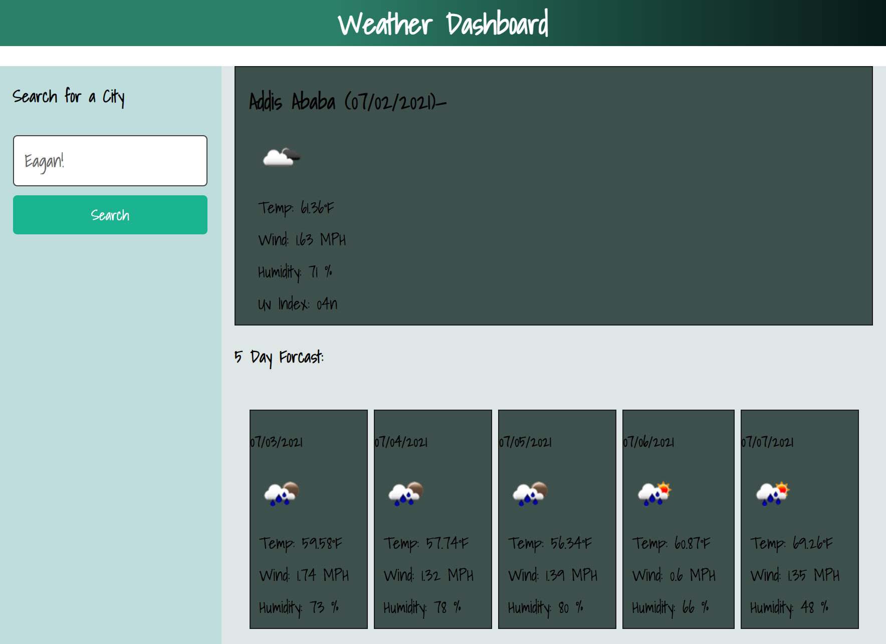

# hw6-server-side-apis

```
This application is designed for a travelers to see the weather outlook for multiple cities to help them plan a trip ahead

```


## Functionality/Design  


* Searching city will present you with current and future conditions for that city and that city is added to the search history

* View current weather conditions for that city with the 
	Name, 
	Date, 
	Icon representation of weather conditions, 
	Temperature,
	Humidity, 
	Wind speed
	UV index

* View the UV index with a color that indicates whether the conditions are favorable, moderate, or severe

* Future weather conditions for that city presented with a 5-day forecast that displays 
	Date, 
	Icon representation of weather conditions, 
	Temperature, 
	Wind speed, 
	Humidity

* Clicking a city in the search history present with current and future conditions for that city again


## Mock-Up portfolio

The following animation demonstrates the application appearance and functionality:




## Links to the deployed application

* The URL of the functional, deployed application.
https://tewol.github.io/hw6-server-side-apis/

* The URL of the GitHub repository, with a unique name and a readme describing the project.
https://github.com/Tewol/hw6-server-side-apis/


© 2021 Hewan Redie